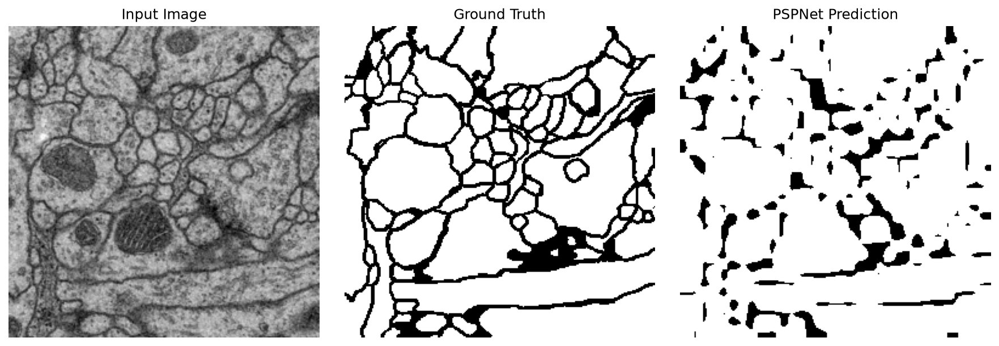
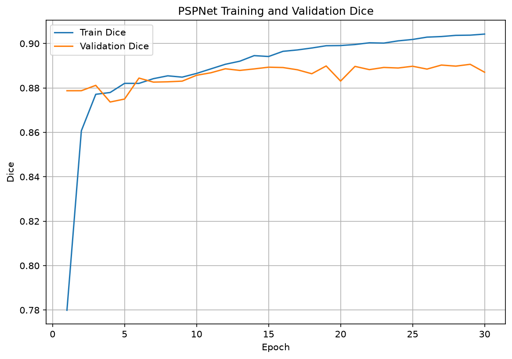
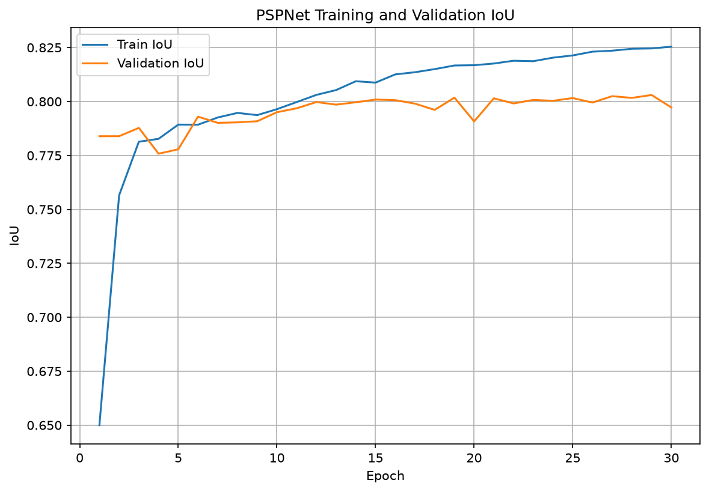
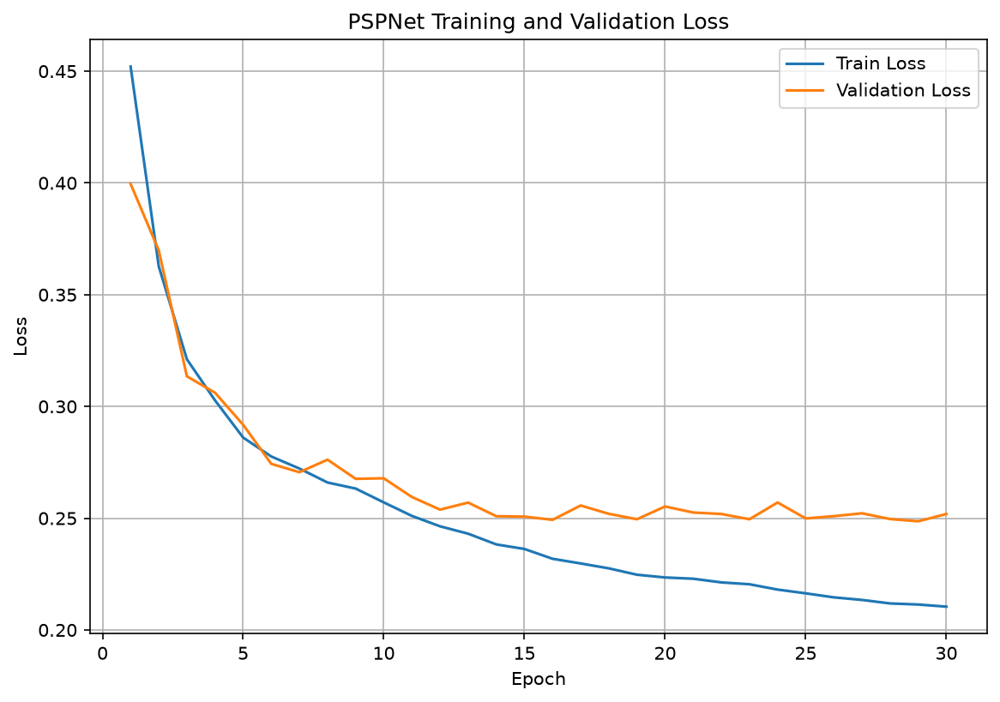

# Week4 PSPNet

ISBI 2012 전자현미경 영상에서 세포막 분할을 수행하기 위해
Pyramid Pooling Module을 포함한 경량 PSPNet을 구현하였다.

원 논문의 ResNet backbone, dilated convolution, auxiliary loss는 제외하고,
Pyramid Pooling의 핵심 아이디어를 학습하기 위한 경량 구조로 구현하였다.

## Result

| Model | Parameters | Best Epoch | Validation Dice | Validation IoU |
|---|---:|---:|---:|---:|
| Lightweight PSPNet | 1,708,705 | 29 | 0.8906 | 0.8030 |

## Analysis

경량 PSPNet은 1,708,705개의 파라미터로 U-Net보다 가볍고
epoch당 학습 시간이 짧았다.

그러나 Validation Dice 0.8906, IoU 0.8030으로
U-Net의 Dice 0.9520, IoU 0.9085보다 낮은 성능을 기록하였다.

PSPNet은 Pyramid Pooling Module을 통해 넓은 문맥 정보를 활용할 수 있었지만,
저해상도 feature를 직접 업샘플링하는 구조로 인해 얇고 복잡한 세포막 경계가
끊기거나 누락되는 경향을 보였다.

반면 U-Net은 encoder와 decoder 사이의 skip connection을 통해
고해상도 공간 정보를 전달하므로 세밀한 경계 복원에 더 유리하였다.

## Prediction

## Training Curves

### Dice

### IoU

### Loss

