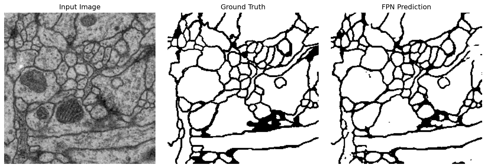
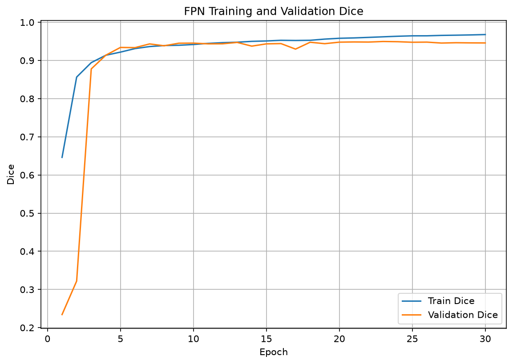
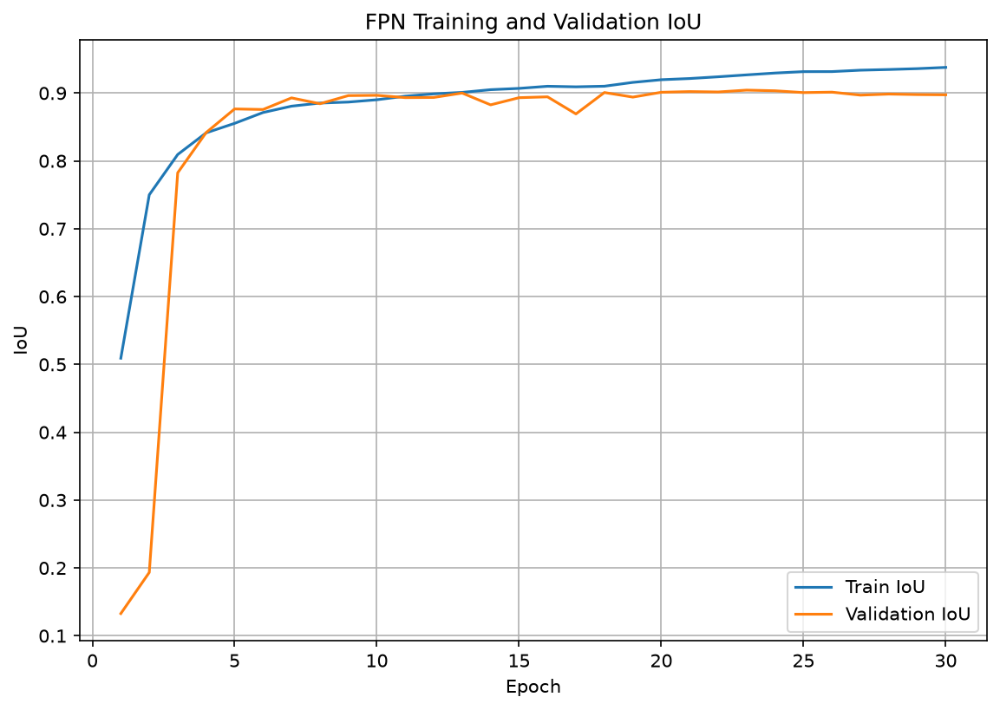
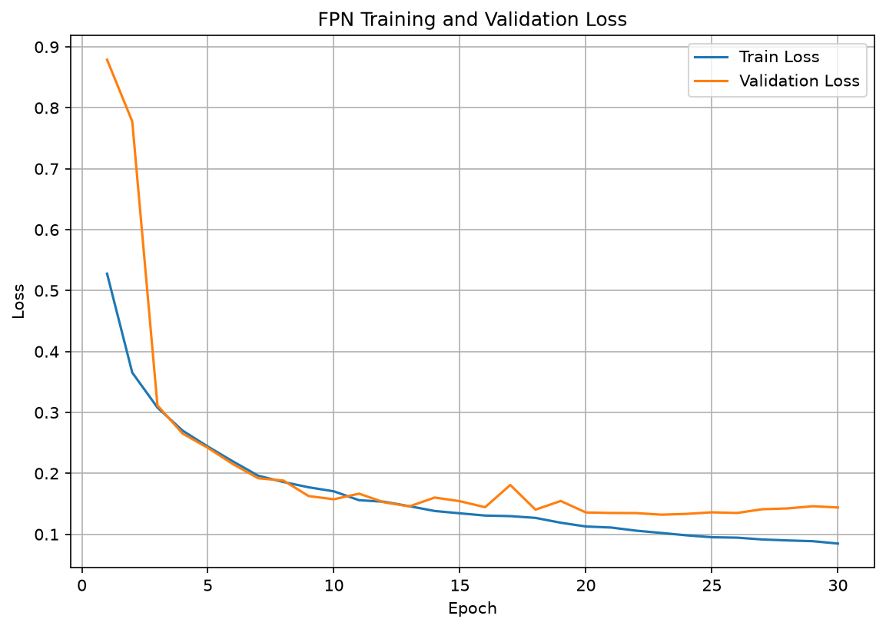

# Week5 FPN

ISBI 2012 전자현미경 영상에서 세포막 분할을 수행하기 위해
Feature Pyramid Network 기반 segmentation 모델을 구현하였다.

Bottom-up encoder에서 여러 해상도의 feature를 추출하고,
top-down pathway와 lateral connection을 통해
고수준 의미 정보와 세밀한 공간 정보를 결합하였다.

## Result

| Model | Parameters | Best Epoch | Validation Dice | Validation IoU |
|---|---:|---:|---:|---:|
| FPN Segmentation | 5,870,433 | 23 | 0.9497 | 0.9043 |

## Analysis

FPN은 U-Net보다 적은 파라미터를 사용하면서도
Validation Dice 0.9497과 IoU 0.9043을 기록하여
U-Net과 유사한 성능을 보였다.

PSPNet보다 얇고 복잡한 세포막 경계를 더 정확하게 복원했으며,
이는 여러 해상도의 feature를 top-down pathway와
lateral connection으로 결합한 효과로 볼 수 있다.

다만 epoch 23 이후에는 학습 성능이 계속 향상된 반면
검증 성능은 감소하여 약한 과적합이 나타났다.

## Prediction

## Training Curves

### Dice

### IoU

### Loss

