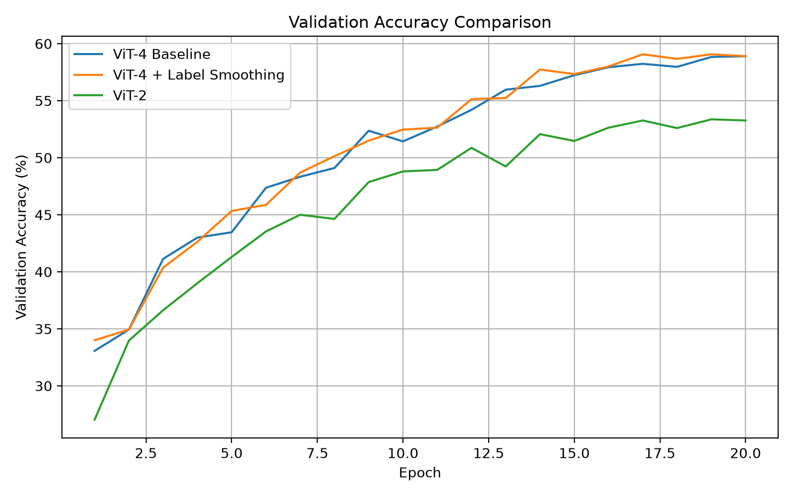
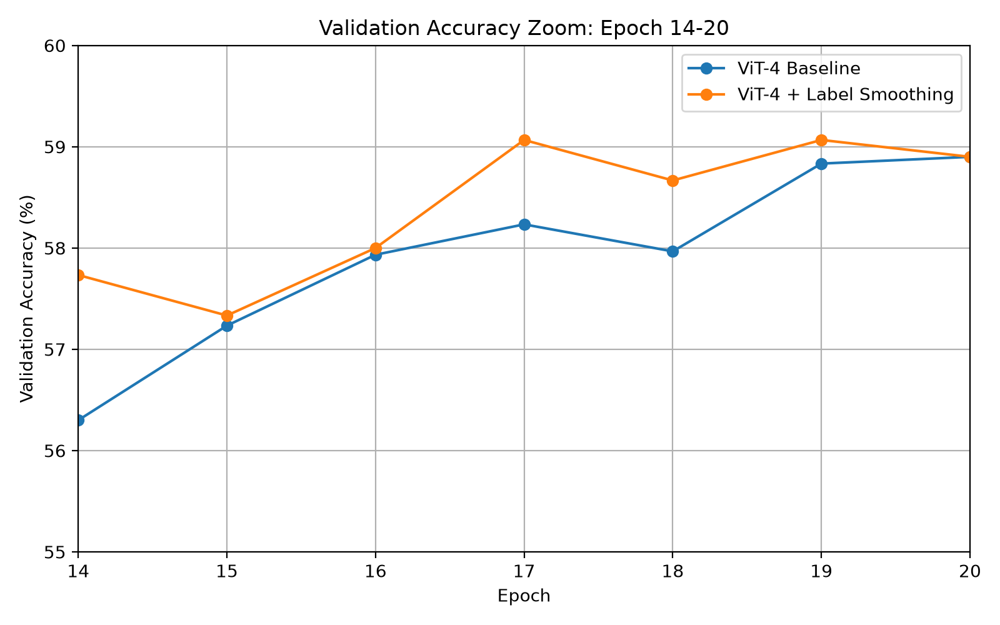
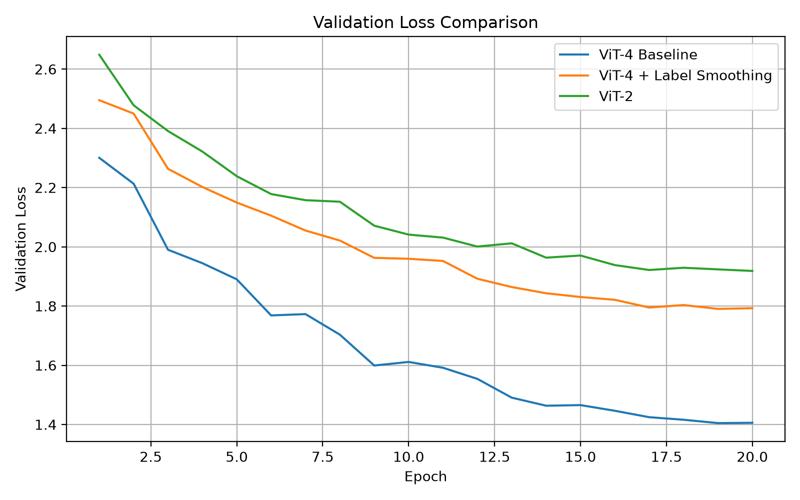
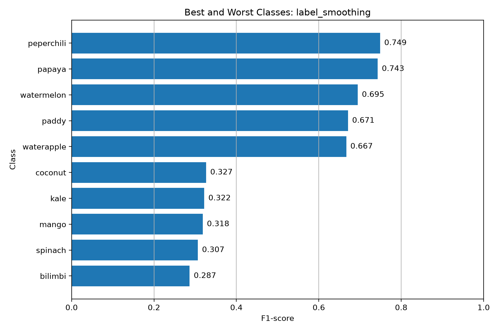
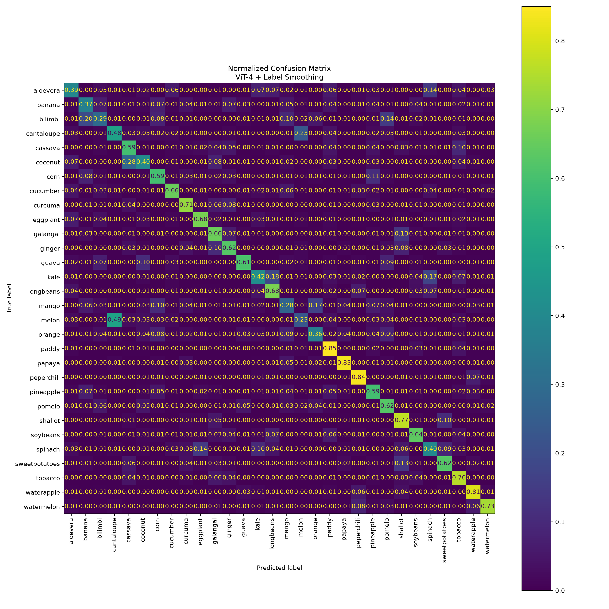

# Vision Transformer 구현 및 실험

## 1. 실습 개요

본 실습에서는 논문 **An Image is Worth 16×16 Words: Transformers for Image Recognition at Scale (ViT, ICLR 2021)** 의 핵심 구조를 기반으로 경량 Vision Transformer를 직접 구현하고, Plants Classification 데이터셋을 이용하여 30-class image classification을 수행하였다.

원 논문의 ViT-Base 모델을 그대로 사용하거나 pretrained weight를 불러오는 방식이 아니라, **Patch Embedding, CLS Token, Positional Embedding, Multi-Head Self-Attention, MLP, Transformer Encoder 구조를 직접 구현**하였다.

실습 환경과 데이터 규모를 고려하여 원 논문보다 작은 모델을 구성하였으며, 이후 다음 두 가지 추가 실험을 수행하였다.

1. **Label Smoothing 적용**
2. **Transformer Depth 변경 (4 Blocks → 2 Blocks)**

이를 통해 단순 구현뿐 아니라 모델 구조 및 regularization 설정 변화가 성능에 어떤 영향을 미치는지 비교하였다.

---

# 2. Dataset

본 실습에서는 튜토리얼에서 예제로 제시된 **Plants Classification Dataset**을 사용하였다.

Dataset:

https://www.kaggle.com/datasets/marquis03/plants-classification

총 30개의 식물 클래스로 구성되어 있으며 데이터는 다음과 같이 분리되어 있다.

| Split      |     Images | Images per Class |
| ---------- | ---------: | ---------------: |
| Train      |     21,000 |              700 |
| Validation |      3,000 |              100 |
| Test       |      6,000 |              200 |
| **Total**  | **30,000** |        **1,000** |

클래스 예시:

* aloevera
* banana
* bilimbi
* cantaloupe
* cassava
* coconut
* corn
* cucumber
* papaya
* peperchili
* watermelon
* etc.

모든 클래스의 데이터 수가 동일하므로 class imbalance가 거의 없는 balanced dataset이다.

---

# 3. Data Preprocessing

원본 이미지의 크기가 서로 다르기 때문에 모델 입력 크기를 통일하기 위해 모든 이미지를 **128×128**로 변환하였다.

Baseline 설정:

```text
Input Image Size : 128 × 128
Channels         : RGB (3)
Patch Size       : 16 × 16
Batch Size       : 32
Classes          : 30
```

128×128 이미지를 16×16 Patch로 나누면 다음과 같다.

```text
128 / 16 = 8

8 × 8 = 64 patches
```

따라서 하나의 이미지는 총 **64개의 Patch Token**으로 변환된다.

여기에 classification을 위한 **CLS Token 1개**가 추가되므로 Transformer Encoder의 입력 sequence는 총 **65 Tokens**이 된다.

---

# 4. Vision Transformer 구조

전체 모델 구조는 다음과 같다.

```text
Input Image
    ↓
Patch Embedding
    ↓
CLS Token 추가
    ↓
Positional Embedding 추가
    ↓
Transformer Encoder × N
    ↓
CLS Token 추출
    ↓
Classification Head
    ↓
30-Class Prediction
```

## 4.1 Patch Embedding

16×16 크기의 RGB Patch 하나는 다음 크기의 값을 가진다.

```text
16 × 16 × 3 = 768
```

각 Patch를 flatten한 뒤 Linear Projection을 통해 **192-dimensional embedding vector**로 변환하였다.

```text
768-dimensional Patch
        ↓
Linear Projection
        ↓
192-dimensional Token
```

---

## 4.2 CLS Token

Transformer 입력 sequence의 첫 위치에 학습 가능한 `[CLS]` Token을 추가하였다.

```text
[CLS], Patch1, Patch2, ... Patch64
```

Transformer Encoder를 거치면서 CLS Token이 다른 Patch Token들과 Self-Attention을 수행하고 이미지 전체 정보를 통합하도록 학습된다.

마지막 Encoder의 CLS Token을 Classification Head에 입력하여 최종 클래스를 예측하였다.

---

## 4.3 Positional Embedding

Transformer는 기본적으로 Token의 순서나 이미지 내 위치 정보를 직접 알 수 없기 때문에 각 Patch의 위치를 표현하는 Positional Embedding을 추가하였다.

```text
Patch Embedding
      +
Position Embedding
```

이를 통해 모델이 이미지 내부의 공간적 위치 정보를 학습할 수 있도록 하였다.

---

## 4.4 Multi-Head Self-Attention

Self-Attention은 각 Patch가 이미지의 다른 Patch들과 어떤 관계를 가지는지 학습한다.

각 Token으로부터 Query, Key, Value를 생성하고 Query와 Key의 유사도를 이용하여 Attention Weight를 계산한 뒤 Value를 가중합한다.

본 구현에서는:

```text
Embedding Dimension : 192
Attention Heads     : 3
```

따라서 한 Attention Head가 담당하는 Dimension은:

```text
192 / 3 = 64
```

이다.

원 논문의 ViT-Base 역시:

```text
768 / 12 = 64
```

이므로 전체 모델 크기는 줄이면서 **Head당 Dimension은 원 논문의 ViT-Base와 동일한 64로 유지**하였다.

---

# 5. 원 논문과 구현 모델 비교

본 실습은 ViT-Base pretrained model을 사용하는 방식이 아니라, 논문의 핵심 구조를 기반으로 한 **Custom Lightweight ViT**를 직접 구현하였다.

| 항목                  |                     Original ViT-B/16 |         본 실습 |
| ------------------- | ------------------------------------: | -----------: |
| Input Size          |                               224×224 |      128×128 |
| Patch Size          |                                 16×16 |        16×16 |
| Transformer Blocks  |                                    12 |            4 |
| Embedding Dimension |                                   768 |          192 |
| Attention Heads     |                                    12 |            3 |
| Dimension per Head  |                                    64 |           64 |
| Parameters          |                                 약 86M |    1,354,590 |
| Pretrained Backbone |                                    사용 |      사용하지 않음 |
| Training            | Large-scale Pretraining + Fine-tuning | From Scratch |

### 모델을 축소한 이유

원 논문의 ViT-Base는 약 86M개의 Parameter를 가지며 대규모 데이터와 연산 자원을 이용해 학습한다.

본 실습에서는:

* 튜토리얼의 간소화된 ViT 구현 조건
* 비교적 작은 Plants Dataset
* CPU 기반 학습 환경
* 반복 실험에 필요한 학습 시간

을 고려하여 모델을 경량화하였다.

단, 모델 크기를 축소하면 연산량은 감소하지만 모델의 feature representation capacity 역시 제한될 수 있다는 trade-off가 존재한다.

---

# 6. 학습 방법

Pretrained weight를 사용하지 않고 모델 Parameter를 Random Initialization한 뒤 Plants Dataset을 이용하여 처음부터 학습하였다.

즉, **From Scratch Training**을 수행하였다.

전체 학습 과정은 다음과 같다.

```text
Input Batch
    ↓
Forward Propagation
    ↓
Prediction
    ↓
Loss Calculation
    ↓
Backpropagation
    ↓
Parameter Update
```

기본 학습 설정:

| Hyperparameter        | Setting |
| --------------------- | ------: |
| Epoch                 |      20 |
| Batch Size            |      32 |
| Initial Learning Rate |    3e-4 |
| Input Size            | 128×128 |
| Patch Size            |      16 |
| Transformer Depth     |       4 |
| Embedding Dimension   |     192 |
| Attention Heads       |       3 |
| Number of Classes     |      30 |
| Device                |     CPU |

Baseline의 Loss Function은 **Cross Entropy Loss**를 사용하였다.

30개의 클래스 중 하나를 예측하는 single-label multi-class classification 문제이기 때문에 Cross Entropy Loss가 적합하다고 판단하였다.

---

# 7. 실험 설계

Baseline 구현 이후 다음 실험을 수행하였다.

| Experiment   | 변경 요소                   | 목적                                      |
| ------------ | ----------------------- | --------------------------------------- |
| Baseline     | Depth 4 + Cross Entropy | 기준 성능 측정                                |
| Experiment 1 | Label Smoothing = 0.1   | Overconfidence 완화 및 일반화 성능 확인           |
| Experiment 2 | Depth 4 → 2             | Transformer Depth가 성능과 모델 크기에 미치는 영향 분석 |

각 비교 실험에서는 변경 대상 외의 조건을 최대한 동일하게 유지하였다.

---

# 8. Experiment 1 — Baseline ViT

Baseline은 Transformer Encoder Block을 4개 사용하였다.

```text
Transformer Blocks : 4
Embedding Dimension: 192
Attention Heads    : 3
Parameters         : 1,354,590
Pretraining        : None
Training           : From Scratch
```

## Test Result

| Metric          |     Result |
| --------------- | ---------: |
| Test Loss       |     1.4811 |
| Accuracy        | **57.68%** |
| Macro Precision |     0.5776 |
| Macro Recall    |     0.5768 |
| Macro F1-score  |     0.5716 |
| Top-3 Accuracy  | **79.80%** |

이 결과를 이후 실험들의 기준 성능으로 사용하였다.

---

# 9. Experiment 2 — Label Smoothing

## 9.1 실험 목적

기본 Cross Entropy에서는 정답 클래스에 대해 매우 높은 Confidence를 갖도록 학습될 수 있다.

이를 완화하고 일반화 성능 변화를 확인하기 위해 다음 설정을 적용하였다.

```text
Label Smoothing = 0.1
```

모델 구조는 Baseline과 동일하게 유지하였다.

```text
Depth              : 4
Embedding Dimension: 192
Attention Heads    : 3
Parameters         : 1,354,590
```

## 9.2 결과

| Metric          |   Baseline | Label Smoothing |      Change |
| --------------- | ---------: | --------------: | ----------: |
| Accuracy        |     57.68% |      **58.38%** | **+0.70%p** |
| Macro Precision | **0.5776** |          0.5766 |     -0.0010 |
| Macro Recall    |     0.5768 |      **0.5838** |     +0.0070 |
| Macro F1-score  |     0.5716 |      **0.5755** |     +0.0039 |
| Top-3 Accuracy  | **79.80%** |          79.35% |     -0.45%p |

이번 실험에서는 Label Smoothing을 적용했을 때 Test Accuracy가 **57.68% → 58.38%**로 0.70%p 향상되었다.

Macro Recall과 Macro F1-score 또한 소폭 증가하였다.

반면 Precision과 Top-3 Accuracy는 소폭 감소하였기 때문에 Label Smoothing이 모든 평가 지표를 일관되게 개선한 것은 아니었다.

따라서 본 실험에서는 **Accuracy, Recall, F1-score 측면에서 일반화 성능이 소폭 개선된 결과**로 해석하였다.

---

# 10. Experiment 3 — Transformer Depth

## 10.1 실험 목적

Transformer Encoder의 반복 횟수가 모델 성능 및 계산 비용에 미치는 영향을 확인하기 위해 Depth를 4에서 2로 변경하였다.

```text
Baseline: Depth = 4
Experiment: Depth = 2
```

그 외 주요 모델 설정은 동일하게 유지하였다.

## 10.2 모델 크기 비교

| Setting                  |    ViT-2 |      ViT-4 |
| ------------------------ | -------: | ---------: |
| Transformer Blocks       |        2 |          4 |
| Parameters               |  760,542 |  1,354,590 |
| Training Time            | 77.7 min |  128.5 min |
| Best Validation Accuracy |   53.37% |     58.90% |
| Test Accuracy            |   52.52% | **57.68%** |
| Macro F1-score           |   0.5205 | **0.5716** |

Depth를 2에서 4로 증가시키면:

```text
Test Accuracy
52.52% → 57.68%

+5.16%p
```

성능이 향상되었다.

반면 Parameter 수와 학습 시간도 증가하였다.

따라서 본 데이터셋 및 실험 조건에서는 Transformer Block을 증가시키면 특징 표현 능력과 분류 성능이 향상되는 대신 연산 비용이 증가하는 **Performance–Efficiency Trade-off**를 확인하였다.

단, Depth 3, 5 등을 모두 실험하지 않았으므로 Depth 4가 최적값이라고 단정하지는 않는다.

---

# 11. 최종 정량적 결과

| Model                   | Test Accuracy | Macro Precision | Macro Recall |   Macro F1 | Top-3 Accuracy |
| ----------------------- | ------------: | --------------: | -----------: | ---------: | -------------: |
| ViT-2                   |        52.52% |          0.5245 |       0.5252 |     0.5205 |         77.87% |
| ViT-4 Baseline          |        57.68% |      **0.5776** |       0.5768 |     0.5716 |     **79.80%** |
| ViT-4 + Label Smoothing |    **58.38%** |          0.5766 |   **0.5838** | **0.5755** |         79.35% |

세 실험 중 **ViT-4 + Label Smoothing**이 가장 높은 Test Accuracy와 Macro F1-score를 기록하였다.

---

# 12. Training Curve 분석

## Validation Accuracy Comparison



Transformer Depth 2 모델은 전체적으로 Baseline 및 Label Smoothing 모델보다 낮은 Validation Accuracy를 보였다.

Label Smoothing 모델과 Baseline 모델의 차이는 작았기 때문에 마지막 Epoch 구간을 확대하여 추가 분석하였다.

## Validation Accuracy Zoom



미세한 차이를 확대하여 Baseline과 Label Smoothing 모델의 Validation Accuracy 변화 추이를 비교하였다.

## Validation Loss Comparison



모든 모델에서 학습이 진행되면서 Validation Loss가 감소하는 추세를 확인하였다.

다만 Label Smoothing은 target distribution 자체를 변경하는 방식이기 때문에 일반 Cross Entropy와 Loss 절대값만으로 직접적인 우열을 판단하지 않고 Accuracy, Precision, Recall, F1-score 등의 동일 평가 지표를 중심으로 비교하였다.

---

# 13. 클래스별 성능 분석

최종 모델인 ViT-4 + Label Smoothing의 클래스별 F1-score를 분석하였다.



## F1-score 상위 클래스

| Class      | F1-score |
| ---------- | -------: |
| peperchili |   0.7760 |
| papaya     |   0.8267 |
| waterapple |   0.7667 |
| watermelon |   0.7737 |
| paddy      |   0.7113 |

## F1-score 하위 클래스

| Class   | F1-score |
| ------- | -------: |
| melon   |   0.2848 |
| mango   |   0.3047 |
| bilimbi |   0.3402 |
| banana  |   0.3926 |
| spinach |   0.4233 |

전체 Accuracy만으로는 확인할 수 없는 클래스별 성능 편차가 존재함을 확인하였다.

특정 클래스의 낮은 성능이 어떤 시각적 특성 때문인지 정확히 판단하기 위해서는 오분류 이미지 및 Confusion Matrix를 함께 확인할 필요가 있다.

---

# 14. Confusion Matrix

최종 모델의 클래스별 오분류 패턴을 분석하기 위해 Normalized Confusion Matrix를 생성하였다.



Confusion Matrix를 통해 전체 Accuracy뿐 아니라 각 클래스에서 모델이 어떤 종류의 오류를 발생시키는지 확인하였다.

---

# 15. 실험 결과 해석

## 15.1 Transformer Depth

Depth 2 모델보다 Depth 4 모델이 높은 성능을 보였다.

```text
ViT-2 : 52.52%
ViT-4 : 57.68%
```

Transformer Block이 증가하면서 Self-Attention과 MLP를 통한 feature transformation이 반복되어 모델의 표현력이 증가한 것으로 해석할 수 있다.

그러나 Parameter 수와 학습 시간이 동시에 증가했기 때문에 모델 크기와 성능 사이에는 trade-off가 존재한다.

---

## 15.2 Label Smoothing

Label Smoothing 적용 후:

```text
Accuracy
57.68% → 58.38%

Macro Recall
0.5768 → 0.5838

Macro F1
0.5716 → 0.5755
```

로 소폭 향상되었다.

그러나 Precision과 Top-3 Accuracy는 소폭 감소하였다.

따라서 본 단일 실험에서는 일반화 성능이 일부 지표에서 개선되었지만, 여러 Random Seed를 이용한 반복 실험을 하지 않았기 때문에 Label Smoothing이 항상 성능을 향상시킨다고 일반화할 수는 없다.

---

# 16. 원 논문과 성능 차이가 발생하는 이유

본 실험 결과를 원 논문의 절대 성능과 직접 비교하기는 어렵다.

주요 차이는 다음과 같다.

### 1. Pretraining 미사용

본 실험은 pretrained weight를 사용하지 않고 Plants Dataset에서 From Scratch로 학습하였다.

ViT는 대규모 데이터에서 pretraining을 수행한 후 Fine-tuning할 때 강점을 보이는 모델이기 때문에 학습 데이터 규모의 차이가 크다.

### 2. 모델 규모 차이

```text
Original ViT-B
12 Blocks
768 Embedding Dim
12 Attention Heads
≈ 86M Parameters

Our ViT
4 Blocks
192 Embedding Dim
3 Attention Heads
≈ 1.35M Parameters
```

모델을 경량화했기 때문에 표현 능력에도 차이가 존재한다.

### 3. 데이터 규모

본 데이터셋은 약 30,000장의 이미지로 구성되어 있으며 원 논문의 대규모 pretraining 환경보다 매우 작다.

---

# 17. 실험의 한계

본 실습에는 다음과 같은 한계가 있다.

1. **Pretrained ViT 미사용**

   * Plants Dataset에서 From Scratch 학습만 수행하였다.

2. **작은 데이터 규모**

   * 약 30,000장의 데이터로 학습하였다.

3. **경량화된 모델**

   * ViT-Base보다 Transformer Depth, Embedding Dimension 및 Attention Head 수를 줄였다.

4. **제한된 Hyperparameter Search**

   * CPU 학습 환경으로 인해 Learning Rate, Weight Decay, Dropout, Batch Size 등을 광범위하게 탐색하지 못하였다.

5. **Single Run**

   * 각 설정을 한 번씩 학습하여 결과를 비교하였다.
   * 여러 Random Seed에 대한 평균 및 표준편차는 측정하지 않았다.

향후에는 동일 실험을 여러 Seed로 반복하여 성능 향상의 재현성을 확인할 필요가 있다.

---

# 18. 추가로 진행할 수 있는 비교 실험

이번 실험에서는 ViT 내부의 구조 및 regularization 변화에 집중하였다.

추가 연구로는 동일한 Plants Classification Dataset에서 CNN 기반 ResNet-18을 학습하여 ViT와 직접 비교할 수 있다.

공정한 비교를 위해 다음 조건을 동일하게 맞추어야 한다.

```text
Dataset Split
Input Resolution
Data Augmentation
Evaluation Metrics
Training / Validation / Test protocol
```

이후 다음 요소를 비교할 수 있다.

* Accuracy
* Macro F1-score
* Parameter 수
* Training Time
* Inference Cost

이를 통해 CNN의 inductive bias와 Transformer 기반 global representation의 차이를 보다 직접적으로 분석할 수 있다.

---

# 19. 배운 점

이번 실습을 통해 다음 내용을 학습하였다.

* 이미지를 Patch 단위 Token으로 변환하는 방법
* Patch Embedding 및 Positional Embedding
* CLS Token의 역할
* Self-Attention의 Query, Key, Value 구조
* Multi-Head Self-Attention
* Transformer Encoder 구성
* Vision Transformer를 From Scratch로 구현하는 방법
* Transformer Depth와 모델 성능의 관계
* Label Smoothing을 이용한 regularization
* Accuracy 이외 Precision, Recall, F1-score, Top-3 Accuracy를 이용한 평가
* Confusion Matrix 및 Class-wise F1-score를 이용한 오류 분석
* 모델 성능뿐 아니라 Parameter 수와 학습 비용을 함께 비교하는 실험 방법

특히 단순히 모델을 구현하는 것뿐 아니라 **하나의 설정을 변경하고, 나머지 조건을 최대한 통제한 뒤 정량적으로 결과를 비교하는 실험 과정이 중요함**을 학습하였다.

---

# 20. 프로젝트 구조

```text
week6_vit/
│
├── data/
│   ├── train/
│   ├── val/
│   └── test/
│
├── checkpoints/
│   ├── best_vit.pth
│   ├── best_vit_ls.pth
│   └── best_vit_depth2.pth
│
├── result/
│   ├── plots/
│   │   ├── vit_loss.png
│   │   ├── vit_accuracy.png
│   │   ├── vit_val_accuracy_comparison.png
│   │   ├── vit_val_accuracy_zoom.png
│   │   ├── vit_val_loss_comparison.png
│   │   ├── vit_test_accuracy_zoom.png
│   │   ├── vit_macro_metrics_zoom.png
│   │   ├── class_f1_label_smoothing.png
│   │   └── confusion_matrix_label_smoothing.png
│   │
│   ├── classification_report_baseline.csv
│   ├── classification_report_label_smoothing.csv
│   └── classification_report_depth2.csv
│
├── dataset.py
├── model.py
├── train.py
├── train_label_smoothing.py
├── train_depth2.py
├── test.py
├── plot_history.py
├── plot_comparison.py
├── analyze_classes.py
└── README.md
```

---

# 21. 실행 방법

## Dataset 확인

```bash
python week6_vit/check_dataset.py
```

## 모델 구조 확인

```bash
python week6_vit/model.py
```

## Baseline 학습

```bash
python week6_vit/train.py
```

## Label Smoothing 학습

```bash
python week6_vit/train_label_smoothing.py
```

## Depth 2 학습

```bash
python week6_vit/train_depth2.py
```

## Test

`test.py`의 `EXPERIMENT` 값을 변경하여 평가한다.

```python
EXPERIMENT = "baseline"
```

또는:

```python
EXPERIMENT = "label_smoothing"
```

또는:

```python
EXPERIMENT = "depth2"
```

실행:

```bash
python week6_vit/test.py
```

## 비교 그래프 생성

```bash
python week6_vit/plot_comparison.py
```

## 클래스별 분석

```bash
python week6_vit/analyze_classes.py
```

---

# 22. 최종 결론

ViT 논문의 핵심 구조를 기반으로 경량 Vision Transformer를 직접 구현하고 Plants Classification 데이터셋에서 From Scratch 학습을 수행하였다.

Baseline ViT-4의 Test Accuracy는 **57.68%**였으며, Label Smoothing을 적용한 모델은 **58.38%**로 가장 높은 Test Accuracy를 기록하였다.

Transformer Depth를 4에서 2로 줄인 모델은 Test Accuracy **52.52%**를 기록하여 모델 크기 및 학습 시간은 감소했으나 성능 역시 감소하였다.

이를 통해 이번 실험 조건에서는:

* Transformer Depth가 모델 성능에 유의미한 영향을 주었고,
* Label Smoothing은 Accuracy, Recall 및 F1-score를 소폭 개선했으며,
* 모델의 성능뿐 아니라 Parameter 수, 학습시간 및 다양한 정량 지표를 함께 비교하는 것이 중요함

을 확인하였다.

---

## Reference

**An Image is Worth 16×16 Words: Transformers for Image Recognition at Scale**

Alexey Dosovitskiy et al., ICLR 2021

Dataset: Plants Classification
https://www.kaggle.com/datasets/marquis03/plants-classification