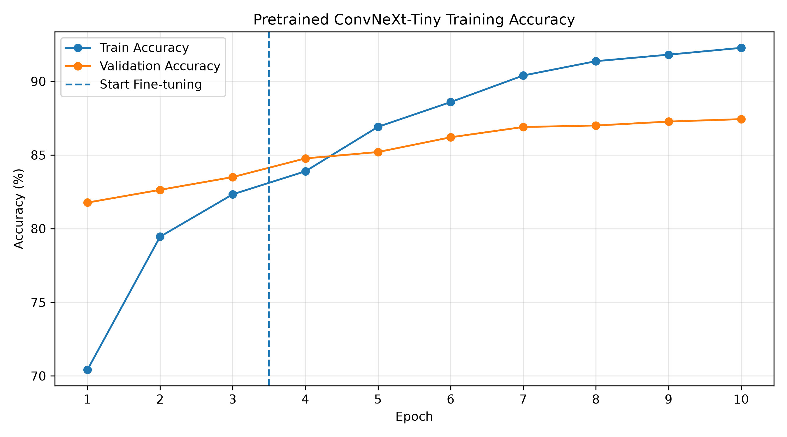
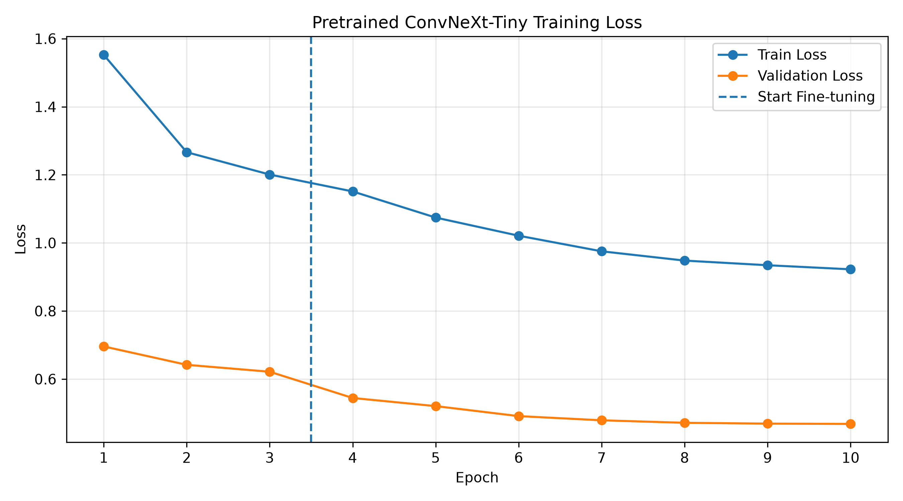
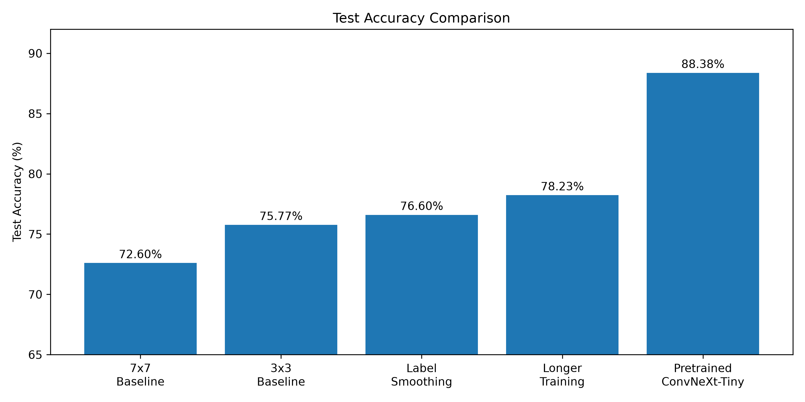

# ConvNeXt 성능 개선 실험 보고서

> 기존 Custom ConvNeXt 구현 및 7×7 / 3×3 kernel ablation에 대한
> 자세한 내용은 [Week 7 ConvNeXt README](README.md)를 참고한다.

**최종 결과: Test Accuracy 88.38%**

---

## 1. 실험 목적

기존 Week 7 ConvNeXt 실습에서는 Liu et al.,
**"A ConvNet for the 2020s" (CVPR 2022)** 논문의 구조를 참고하여
축소형 ConvNeXt 모델을 직접 구현하고 Plants Classification 데이터셋에서
image classification을 수행하였다.

기존 실험에서는 ConvNeXt의 기본 설계인 7×7 depthwise convolution과
kernel size를 3×3으로 변경한 ablation study를 수행하였다.

그 결과 3×3 Custom ConvNeXt가 더 높은 성능을 기록하였으며,

- Best Validation Accuracy: **78.47%**
- Test Accuracy: **75.77%**
- Macro F1-score: **75.01%**

를 기록하였다.

이후 **Test Accuracy 80% 이상**을 목표로 추가적인 성능 개선 실험을 수행하였다.

이번 추가 실험에서는 단순히 최종 성능만 비교하는 것이 아니라,
각 방법을 적용한 이유, 실험 설정, 정량적 결과와 성능 변화의 원인을
함께 분석하는 것을 목표로 하였다.

---

## 2. Dataset 및 기본 실험 환경

기존 ConvNeXt 실험과 동일한 Plants Classification 데이터셋을 사용하였다.

| Split | Number of Images |
|---|---:|
| Train | 21,000 |
| Validation | 3,000 |
| Test | 6,000 |
| Number of Classes | 30 |

Custom ConvNeXt 및 Transfer Learning 실험 모두
입력 이미지 크기는 **128×128**로 설정하였다.

### 2.1 기본 Data Augmentation

Training dataset에는 다음 augmentation을 적용하였다.

- Resize: 144×144
- Random Crop: 128×128
- Random Horizontal Flip: p=0.5
- Random Rotation: ±10°
- ImageNet normalization

Validation 및 Test dataset에는 augmentation을 적용하지 않고
128×128 resize와 ImageNet normalization만 적용하였다.

---

## 3. 성능 개선 기준 모델

성능 개선 실험의 기준 모델은
기존 kernel ablation에서 가장 높은 성능을 기록한
**3×3 Custom ConvNeXt**로 설정하였다.

### 3.1 Architecture

| Setting | Value |
|---|---|
| Architecture | Custom lightweight ConvNeXt |
| Depths | (2, 2, 3, 2) |
| Dims | (64, 128, 256, 512) |
| Depthwise Kernel | 3×3 |
| Number of Classes | 30 |
| Parameters | 약 6.84M |
| Pretrained Weights | No |
| Training Method | From scratch |

### 3.2 Training Configuration

| Hyperparameter | Setting |
|---|---|
| Epochs | 20 |
| Batch Size | 32 |
| Input Size | 128×128 |
| Optimizer | AdamW |
| Learning Rate | 3e-4 |
| Weight Decay | 0.05 |
| Scheduler | CosineAnnealingLR |
| Loss | CrossEntropyLoss |
| Device | CPU |

### 3.3 Baseline Result

| Metric | Result |
|---|---:|
| Best Validation Accuracy | **78.47%** |
| Test Accuracy | **75.77%** |
| Macro F1-score | **75.01%** |

이 결과를 기준으로 이후 성능 개선 실험을 진행하였다.

---

# 4. Experiment 1 - Label Smoothing

## 4.1 적용 이유

기존 CrossEntropyLoss에서는 정답 class에 높은 확률을 부여하도록 학습하기 때문에
모델이 training sample에 대해 지나치게 높은 confidence를 갖게 될 수 있다.

이를 완화하기 위해 **Label Smoothing = 0.1**을 적용하였다.

Label Smoothing은 target distribution을 완전한 one-hot 형태로 사용하지 않고
일부 확률을 다른 class에 분배함으로써
모델의 과도한 confidence를 완화하는 regularization 방법이다.

## 4.2 변경 사항

기존 3×3 baseline의 조건을 유지하고
loss function에 Label Smoothing만 추가하였다.

```text
CrossEntropyLoss
        ↓
CrossEntropyLoss(label_smoothing=0.1)
```

| Setting | Baseline | Label Smoothing |
|---|---:|---:|
| Kernel | 3×3 | 3×3 |
| Epochs | 20 | 20 |
| Learning Rate | 3e-4 | 3e-4 |
| Weight Decay | 0.05 | 0.05 |
| Label Smoothing | 0.0 | **0.1** |

## 4.3 Result

Best Epoch은 **17**이었다.

| Metric | Baseline | + Label Smoothing | Difference |
|---|---:|---:|---:|
| Best Val Accuracy | 78.47% | **79.33%** | **+0.86%p** |
| Test Accuracy | 75.77% | **76.60%** | **+0.83%p** |
| Macro F1 | 75.01% | **75.39%** | **+0.38%p** |

## 4.4 Analysis

Label Smoothing을 적용한 결과 Validation Accuracy와 Test Accuracy가
모두 소폭 향상되었다.

특히 Test Accuracy는

```text
75.77% → 76.60%
```

로 **0.83%p 증가**하였다.

성능 향상 폭이 크지는 않았지만,
모델의 과도한 confidence를 완화하는 regularization이
generalization 성능 향상에 일부 도움이 된 것으로 판단하였다.

따라서 이후 성능 개선 실험에서도 Label Smoothing 0.1을 유지하였다.

---

# 5. Experiment 2 - Strong Augmentation

## 5.1 적용 이유

Training data의 다양성을 증가시키면
training sample 자체에 대한 과적합을 줄이고
generalization 성능을 높일 가능성이 있다.

따라서 기존 augmentation에 **ColorJitter**를 추가하여
보다 강한 data augmentation을 적용하였다.

## 5.2 변경 사항

기존 augmentation에 다음 ColorJitter를 추가하였다.

```python
transforms.ColorJitter(
    brightness=0.15,
    contrast=0.15,
    saturation=0.15,
    hue=0.02,
)
```

따라서 training augmentation은 다음과 같이 구성하였다.

- Resize 144×144
- Random Crop 128×128
- Random Horizontal Flip
- Random Rotation ±10°
- **ColorJitter**
- ImageNet normalization

Label Smoothing 0.1도 동일하게 유지하였다.

## 5.3 Result

| Experiment | Best Val Accuracy |
|---|---:|
| Label Smoothing | **79.33%** |
| + Strong Augmentation | **77.70%** |
| Difference | **-1.63%p** |

Validation Accuracy가 기존 Label Smoothing 실험보다
**1.63%p 감소**하였다.

Validation 성능이 기존 모델보다 명확하게 하락했기 때문에
해당 모델은 최종 후보로 선택하지 않았으며,
Test set에 대한 추가 평가는 수행하지 않았다.

## 5.4 Analysis

일반적으로 data augmentation은 overfitting을 줄이고
generalization 성능 향상에 도움을 줄 수 있지만,
본 실험에서는 오히려 성능이 감소하였다.

Plants Classification에서는 식물이나 과일의 색상 정보가
class를 구분하는 데 중요한 visual feature일 가능성이 있다.

따라서 brightness, saturation, hue 등을 변화시키는 ColorJitter가
분류에 유용한 색상 정보를 일부 왜곡하여
성능 저하에 영향을 주었을 가능성이 있다고 해석하였다.

다만 본 실험에서는 ColorJitter 유무만 비교하였으므로,
성능 저하의 원인을 색상 변화로 단정할 수는 없다.

이에 이후 실험에서는 Strong Augmentation을 제외하고
기존 augmentation을 다시 사용하였다.

---

# 6. Experiment 3 - Longer Training

## 6.1 적용 이유

Label Smoothing 적용 이후에도
Test Accuracy는 76.60%로 목표인 80%에 도달하지 못하였다.

기존 학습에서는 총 20 epoch만 사용하였기 때문에
모델이 충분히 수렴하기 전에 학습이 종료되었을 가능성을 고려하였다.

따라서 총 학습 epoch를 **20 → 30**으로 증가시키고,
CosineAnnealingLR의 schedule 역시 30 epoch에 맞추어 확장하였다.

## 6.2 변경 사항

| Setting | Previous | Longer Training |
|---|---:|---:|
| Kernel | 3×3 | 3×3 |
| Label Smoothing | 0.1 | 0.1 |
| Epochs | 20 | **30** |
| Scheduler T_max | 20 | **30** |
| Learning Rate | 3e-4 | 3e-4 |
| Weight Decay | 0.05 | 0.05 |

## 6.3 Result

Best Epoch은 **23**이었다.

| Metric | 3×3 Baseline | Longer Training | Difference |
|---|---:|---:|---:|
| Best Val Accuracy | 78.47% | **80.37%** | **+1.90%p** |
| Test Accuracy | 75.77% | **78.23%** | **+2.46%p** |
| Macro F1 | 75.01% | **76.91%** | **+1.90%p** |

Label Smoothing 실험과 비교하면 Test Accuracy가

```text
76.60% → 78.23%
```

로 **1.63%p 추가 향상**되었다.

## 6.4 Analysis

학습 epoch를 늘리고 learning-rate schedule을 확장한 결과
Validation과 Test 성능이 모두 개선되었다.

따라서 기존 20 epoch 설정에서는 모델이 충분히 수렴하기 전에
학습이 종료되었을 가능성이 있다고 판단하였다.

Custom ConvNeXt 실험 중 가장 높은 결과는

- Best Validation Accuracy: **80.37%**
- Test Accuracy: **78.23%**
- Macro F1-score: **76.91%**

였다.

3×3 baseline의 Test Accuracy 75.77%와 비교하면
**2.46%p 향상**되었다.

하지만 목표인 Test Accuracy 80%에는
여전히 **1.77%p 부족**하였다.

---

# 7. Experiment 4 - LayerScale + DropPath

## 7.1 적용 이유

ConvNeXt에서는 LayerScale과 stochastic depth를
training recipe에 활용한다.

이에 custom ConvNeXt를 원 논문의 설계에 보다 가깝게 구성하면서
regularization을 추가하기 위해

- LayerScale
- DropPath

를 적용하였다.

## 7.2 LayerScale

Residual branch의 output에 trainable scale parameter를 적용하였다.

초기값은 다음과 같이 설정하였다.

```text
LayerScale init = 1e-6
```

## 7.3 DropPath

Residual branch를 일정 확률로 skip하는
stochastic depth 방식의 regularization을 적용하였다.

최대 DropPath rate는

```text
0.1
```

로 설정하였으며,
block depth에 따라 0부터 0.1까지 증가하도록 구성하였다.

## 7.4 Training Configuration

| Setting | Value |
|---|---|
| Kernel | 3×3 |
| Epochs | 30 |
| Label Smoothing | 0.1 |
| LayerScale Init | 1e-6 |
| Maximum DropPath | 0.1 |
| Learning Rate | 3e-4 |
| Weight Decay | 0.05 |
| Scheduler | CosineAnnealingLR |

Model parameters는 약 **6.84M**으로
기존 custom model과 거의 동일하였다.

## 7.5 Result

Best Epoch은 **25**였다.

| Experiment | Best Val Accuracy |
|---|---:|
| Longer Training | **80.37%** |
| + LayerScale + DropPath | **75.60%** |
| Difference | **-4.77%p** |

최종 epoch의 Training Accuracy 역시 약 **88.74%**로,
LayerScale과 DropPath를 사용하지 않은 Longer Training 실험보다 낮았다.

Validation Accuracy가 기존 최고 모델보다 크게 감소했기 때문에
해당 모델은 최종 후보로 선택하지 않았다.

또한 Validation set을 기준으로 model selection을 수행하고
Test set에 대한 반복적인 확인을 피하기 위해
해당 모델의 Test Accuracy는 별도로 측정하지 않았다.

## 7.6 Analysis

LayerScale과 DropPath는 원 논문의 더 깊은 ConvNeXt에서는
학습 안정화와 regularization에 활용되지만,
본 실험에서는 학습 성능과 Validation 성능이 모두 감소하였다.

본 custom ConvNeXt는 약 6.84M parameters와
총 9개의 ConvNeXt block을 사용하는 축소된 모델이다.

따라서 LayerScale의 매우 작은 초기값 1e-6과
DropPath 0.1을 동시에 적용한 것이
30 epoch의 from-scratch 환경에서는
residual branch의 학습을 지나치게 억제했을 가능성이 있다.

다만 LayerScale과 DropPath를 동시에 적용하였기 때문에
어느 요소가 성능 하락에 더 큰 영향을 주었는지는
본 실험만으로 판단할 수 없다.

---

# 8. Custom ConvNeXt 성능 개선 결과 종합

Custom ConvNeXt에서 수행한 추가 실험을 정리하면 다음과 같다.

| Experiment | 주요 변경 | Best Val Acc | Test Acc | Macro F1 |
|---|---|---:|---:|---:|
| 3×3 Baseline | Kernel 3×3 | 78.47% | 75.77% | 75.01% |
| + Label Smoothing | LS = 0.1 | 79.33% | 76.60% | 75.39% |
| + Strong Augmentation | ColorJitter | 77.70% | - | - |
| + Longer Training | 30 epochs | **80.37%** | **78.23%** | **76.91%** |
| + LayerScale + DropPath | LayerScale + DP | 75.60% | - | - |

Custom ConvNeXt에서 가장 효과적이었던 방법은
Label Smoothing과 Longer Training이었다.

기준 모델과 비교하면 Test Accuracy는

```text
75.77% → 78.23%
```

로 **2.46%p 향상**되었다.

그러나 Custom ConvNeXt의 개선만으로는
목표였던 Test Accuracy 80%에 도달하지 못하였다.

---

# 9. Experiment 5 - Pretrained ConvNeXt-Tiny Transfer Learning

## 9.1 적용 이유

Custom ConvNeXt를 from scratch로 학습하면서
여러 regularization 및 training strategy를 적용하였지만
최고 Test Accuracy는 78.23%였다.

따라서 추가적인 성능 향상을 위해
ImageNet에서 사전학습된 **ConvNeXt-Tiny**를 이용한
Transfer Learning 실험을 수행하였다.

이번 실험은 기존 custom model 자체를 개선한 실험과는 다르며,
**pretrained backbone을 사용하는 별도의 성능 개선 실험**으로 구분하였다.

---

## 9.2 Pretrained Model

torchvision에서 제공하는 ImageNet pretrained
ConvNeXt-Tiny weights를 사용하였다.

```python
model = convnext_tiny(
    weights=ConvNeXt_Tiny_Weights.DEFAULT
)
```

기존 ImageNet classifier를 제거하고
Plants Classification의 30개 class에 맞게
마지막 classifier를 변경하였다.

```python
in_features = model.classifier[2].in_features
model.classifier[2] = nn.Linear(in_features, 30)
```

### Model Setting

| Setting | Value |
|---|---|
| Model | ConvNeXt-Tiny |
| Pretraining | ImageNet |
| Number of Classes | 30 |
| Input Size | 128×128 |
| Total Parameters | **27,843,198** |
| Batch Size | 32 |
| Device | CPU |

기존 Custom ConvNeXt 실험과 동일하게
128×128 input을 사용하였다.

따라서 이번 실험에서는 별도의 input resolution 증가 없이
pretrained representation과 fine-tuning을 이용하여
성능을 개선하였다.

---

# 10. Transfer Learning Strategy

Transfer Learning은 두 단계로 진행하였다.

## 10.1 Phase 1 - Classifier Training

먼저 pretrained ConvNeXt backbone을 freeze하고
새롭게 추가한 30-class classifier만 학습하였다.

```text
Pretrained ConvNeXt Backbone
          ↓
        Freeze
          ↓
  30-class Classifier
          ↓
         Train
```

| Setting | Value |
|---|---|
| Epochs | 3 |
| Trainable Part | Classifier |
| Trainable Parameters | 24,606 |
| Learning Rate | 1e-3 |

Pretrained feature extractor를 유지한 상태에서
새로운 Plants Classification task에 맞는
classifier를 먼저 학습하기 위한 단계이다.

---

## 10.2 Phase 2 - Fine-tuning

Classifier 학습 이후에는
ConvNeXt의 마지막 feature stage를 추가로 unfreeze하였다.

```text
Earlier ConvNeXt Stages
          ↓
        Freeze

Last ConvNeXt Stage
          +
      Classifier
          ↓
      Fine-tuning
```

| Setting | Value |
|---|---|
| Epochs | 7 |
| Trainable Part | Last Stage + Classifier |
| Trainable Parameters | 14,314,014 |
| Learning Rate | 3e-5 |

Pretrained representation을 지나치게 크게 변경하지 않도록
classifier 학습보다 작은 learning rate인 **3e-5**를 사용하였다.

---

# 11. Transfer Learning Training Configuration

| Hyperparameter | Setting |
|---|---|
| Total Epochs | 10 |
| Phase 1 | Classifier, 3 epochs |
| Phase 2 | Last Stage + Classifier, 7 epochs |
| Batch Size | 32 |
| Input Size | 128×128 |
| Optimizer | AdamW |
| Classifier LR | 1e-3 |
| Fine-tuning LR | 3e-5 |
| Weight Decay | 0.05 |
| Label Smoothing | 0.1 |
| Scheduler | CosineAnnealingLR |
| Model Selection | Best Validation Accuracy |
| Device | CPU |

Label Smoothing은 앞선 Custom ConvNeXt 실험에서
소폭의 성능 향상이 확인되었기 때문에
Transfer Learning에서도 동일하게 0.1을 사용하였다.

---

# 12. Transfer Learning Training Result

학습 결과는 다음과 같다.

| Epoch | Phase | Train Acc | Validation Acc |
|---:|---|---:|---:|
| 1 | Classifier | 70.42% | 81.77% |
| 2 | Classifier | 79.45% | 82.63% |
| 3 | Classifier | 82.33% | 83.50% |
| 4 | Fine-tuning | 83.89% | 84.77% |
| 5 | Fine-tuning | 86.91% | 85.20% |
| 6 | Fine-tuning | 88.59% | 86.20% |
| 7 | Fine-tuning | 90.40% | 86.90% |
| 8 | Fine-tuning | 91.37% | 87.00% |
| 9 | Fine-tuning | 91.81% | 87.27% |
| 10 | Fine-tuning | **92.27%** | **87.43%** |

Best Epoch은 **10**이며,
Best Validation Accuracy는 **87.43%**를 기록하였다.

## 12.1 Accuracy Curve



Epoch 1~3에서는 classifier만 학습하였으며,
Epoch 4부터 마지막 ConvNeXt stage를 함께 fine-tuning하였다.

Validation Accuracy는 Epoch 1의 81.77%에서
Epoch 10의 87.43%까지 지속적으로 증가하였다.

## 12.2 Loss Curve



Training loss와 Validation loss 모두
학습이 진행될수록 감소하였다.

Fine-tuning 시작 이후에도 Validation loss가 감소하면서
Validation Accuracy가 함께 증가하였다.

---

# 13. Transfer Learning 학습 결과 분석

Classifier만 학습한 첫 epoch에서부터
Validation Accuracy가 **81.77%**를 기록하였다.

이는 Custom ConvNeXt의 최고 Validation Accuracy인
80.37%보다도 높은 값이다.

Custom ConvNeXt는 random initialization에서부터
visual representation을 직접 학습해야 했던 반면,
pretrained ConvNeXt-Tiny는 ImageNet pretraining을 통해
이미 다양한 visual feature를 학습한 상태였다.

따라서 ImageNet에서 학습된 pretrained feature가
Plants Classification에서도 유용하게 활용된 것으로 해석할 수 있다.

Classifier 학습이 끝난 Epoch 3의 Validation Accuracy는
**83.50%**였다.

이후 마지막 ConvNeXt stage를 fine-tuning하면서 Validation Accuracy는

```text
83.50%
→ 84.77%
→ 85.20%
→ 86.20%
→ 86.90%
→ 87.00%
→ 87.27%
→ 87.43%
```

으로 지속적으로 증가하였다.

따라서 classifier만 새롭게 학습하는 것에서 끝내지 않고
pretrained backbone의 상위 feature를 target dataset에 맞게
fine-tuning한 것이 추가적인 성능 향상에 기여한 것으로 판단하였다.

---

# 14. Final Test Result

Validation Accuracy가 가장 높은 Epoch 10 checkpoint를 저장하고
해당 모델을 Test dataset에서 최종 평가하였다.

## 14.1 Quantitative Result

| Metric | Result |
|---|---:|
| Best Validation Accuracy | **87.43%** |
| Test Accuracy | **88.38%** |
| Macro Precision | **88.38%** |
| Macro Recall | **88.38%** |
| Macro F1-score | **88.23%** |
| Weighted F1-score | **88.23%** |

최종 Test Accuracy는 **88.38%**로
목표였던 **Test Accuracy 80% 이상을 달성하였다.**

---

# 15. 전체 성능 개선 비교

기존 ConvNeXt 실험부터 최종 Transfer Learning까지
Test Accuracy의 변화를 정리하면 다음과 같다.

| Experiment | Test Accuracy | 7×7 Baseline 대비 |
|---|---:|---:|
| 7×7 Custom Baseline | 72.60% | - |
| 3×3 Custom Baseline | 75.77% | +3.17%p |
| + Label Smoothing | 76.60% | +4.00%p |
| + Longer Training | 78.23% | +5.63%p |
| **Pretrained ConvNeXt-Tiny** | **88.38%** | **+15.78%p** |

## 15.1 Test Accuracy Comparison



전체 실험의 Test Accuracy 변화는 다음과 같다.

```text
7×7 Custom Baseline
72.60%
    ↓
3×3 Custom Baseline
75.77%
    ↓
+ Label Smoothing
76.60%
    ↓
+ Longer Training
78.23%
    ↓
Pretrained ConvNeXt-Tiny
88.38%
```

3×3 Custom baseline과 비교하면

```text
75.77% → 88.38%
```

로 **12.61%p 향상**되었다.

Custom ConvNeXt 최고 모델과 비교하면

```text
78.23% → 88.38%
```

로 **10.15%p 향상**되었다.

---

# 16. Custom Model vs Pretrained Model

Transfer Learning 모델이 크게 높은 성능을 기록하였지만,
두 모델의 성능 차이를 단순히 pretraining 효과만으로
해석해서는 안 된다.

| Setting | Custom ConvNeXt | Pretrained ConvNeXt-Tiny |
|---|---|---|
| Parameters | 약 6.84M | 약 27.84M |
| Pretraining | No | ImageNet |
| Training | From scratch | Transfer Learning |
| Input Size | 128×128 | 128×128 |
| Best Val Acc | 80.37% | **87.43%** |
| Test Acc | 78.23% | **88.38%** |
| Macro F1 | 76.91% | **88.23%** |

Pretrained ConvNeXt-Tiny는

1. ImageNet에서 이미 visual representation을 학습하였고,
2. Custom ConvNeXt보다 parameter 수와 model capacity가 크다.

따라서 약 10.15%p의 Test Accuracy 차이에는
**pretraining 효과와 model capacity 차이가 모두 포함되어 있다.**

즉, 본 실험만으로 10.15%p의 향상이
순수하게 pretraining 때문이라고 결론 내릴 수는 없다.

향후 동일한 ConvNeXt-Tiny architecture에 대해
random initialization과 ImageNet pretrained weights를 비교한다면
pretraining 자체의 효과를 보다 엄밀하게 분석할 수 있다.

---

# 17. Class-wise Performance Analysis

전체 Test Accuracy는 88.38%로 크게 향상되었지만,
class별 성능에는 여전히 차이가 존재하였다.

## 17.1 높은 성능을 보인 Class

| Class | Precision | Recall | F1-score |
|---|---:|---:|---:|
| peperchili | 97.06% | 99.00% | **98.02%** |
| sweetpotatoes | 95.17% | 98.50% | **96.81%** |
| banana | 96.98% | 96.50% | **96.74%** |
| corn | 96.04% | 97.00% | **96.52%** |
| cucumber | 95.57% | 97.00% | **96.28%** |

대부분의 class에서 높은 Precision과 Recall을 기록하였으며,
여러 class의 F1-score가 0.9 이상을 기록하였다.

특히 peperchili는 Recall 99.00%,
F1-score 98.02%로 가장 높은 수준의 분류 성능을 보였다.

---

## 17.2 낮은 성능을 보인 Class

| Class | Precision | Recall | F1-score |
|---|---:|---:|---:|
| melon | 47.62% | 40.00% | **43.48%** |
| cantaloupe | 47.22% | 51.00% | **49.04%** |
| orange | 87.50% | 73.50% | 79.89% |
| mango | 85.39% | 76.00% | 80.42% |
| coconut | 93.13% | 74.50% | 82.78% |

특히 **melon과 cantaloupe**의 F1-score가
다른 class보다 크게 낮았다.

기존 Custom ConvNeXt의 confusion matrix에서도
melon과 cantaloupe 사이의 오분류가 관찰되었다.

따라서 두 class가 유사한 visual characteristics를 가지고 있어
본 dataset에서 상대적으로 구분하기 어려운 class일 가능성이 있다.

다만 Transfer Learning 모델의 confusion matrix를
별도로 생성하지 않았으므로,
최종 모델에서도 두 class가 서로 직접적으로 얼마나 혼동되는지는
추가적인 confusion matrix 분석을 통해 확인할 필요가 있다.

Transfer Learning을 통해 전체 성능은 크게 향상되었지만,
일부 어려운 class의 분류 문제는 여전히 남아 있음을 확인하였다.

---

# 18. 개선 방법별 결과 분석

## 18.1 효과가 있었던 방법

### Kernel Size 3×3

7×7 → 3×3 변경으로 Test Accuracy가

```text
72.60% → 75.77%
```

로 **3.17%p 향상**되었다.

원 논문에서는 large kernel이 최종 구조에 사용되었지만,
본 실험의 작은 dataset, 128×128 input,
축소 model 및 짧은 training 환경에서는
3×3 kernel이 더 높은 성능을 기록하였다.

따라서 architecture design의 효과가
실험 환경에 따라 달라질 수 있음을 관찰하였다.

### Label Smoothing

Test Accuracy:

```text
75.77% → 76.60%
```

**+0.83%p**

큰 변화는 아니었지만
regularization을 통해 generalization 성능이 소폭 향상되었다.

### Longer Training

Label Smoothing 실험 대비 Test Accuracy:

```text
76.60% → 78.23%
```

**+1.63%p**

20 epoch보다 30 epoch에서 더 높은 성능을 기록하여
기존 training duration이 다소 부족했을 가능성을 확인하였다.

### Transfer Learning

Custom ConvNeXt 최고:

```text
78.23%
```

Pretrained ConvNeXt-Tiny:

```text
88.38%
```

**+10.15%p**

전체 추가 실험 중 가장 큰 성능 향상을 기록하였다.

---

## 18.2 효과가 없었던 방법

### Strong Augmentation

Validation Accuracy:

```text
79.33% → 77.70%
```

**-1.63%p**

ColorJitter가 plant classification에 유용한
색상 정보를 변화시켰을 가능성이 있다.

### LayerScale + DropPath

Validation Accuracy:

```text
80.37% → 75.60%
```

**-4.77%p**

본 축소 모델과 제한된 training epoch에서는
regularization 및 residual scaling이
학습을 지나치게 억제했을 가능성이 있다.

따라서 논문에서 효과적인 technique도
model scale, dataset 및 training configuration에 따라
동일한 효과를 보장하지 않는다는 점을 관찰하였다.

---

# 19. Limitations

본 추가 실험에는 다음과 같은 한계가 있다.

1. 모든 실험에서 단일 random seed를 사용하였다.

2. Learning Rate, Weight Decay, Batch Size 등을
   systematic하게 grid search하지 않았다.

3. Custom ConvNeXt에서는 CPU training 비용 때문에
   원 논문의 장기간 training을 그대로 재현하지 못하였다.

4. Mixup, CutMix, RandAugment, Random Erasing, EMA 등
   ConvNeXt 원 논문의 전체 training recipe를 재현하지 않았다.

5. Strong Augmentation 실험에서는 ColorJitter를 추가했지만
   augmentation 강도를 개별적으로 ablation하지 않았다.

6. LayerScale과 DropPath를 동시에 추가하였기 때문에
   각각의 독립적인 효과를 확인하지 못하였다.

7. Pretrained ConvNeXt-Tiny는 Custom ConvNeXt보다
   parameter 수와 model capacity가 크므로,
   두 모델의 성능 차이를 순수한 pretraining 효과로 볼 수 없다.

8. Transfer Learning에서도 기존 실험과 동일한 128×128 input을 사용하여
   pretrained ConvNeXt-Tiny의 일반적인 224×224 평가 설정과 차이가 있다.

9. 최종 모델에서도 melon과 cantaloupe class의
   F1-score가 다른 class에 비해 낮았다.

따라서 향후에는 동일 architecture에서
from-scratch와 pretrained model을 비교하고,
hyperparameter search 및 class별 error analysis를 추가한다면
보다 엄밀한 성능 비교가 가능할 것이다.

---

# 20. Conclusion

본 성능 개선 실험에서는
기존 Custom ConvNeXt 3×3 모델의 Test Accuracy **75.77%**를 기준으로
다양한 성능 개선 방법을 단계적으로 적용하였다.

먼저 Label Smoothing을 적용하여
Test Accuracy를 **76.60%**로 향상시켰다.

Strong Augmentation에서는 Validation Accuracy가 감소하였으며,
ColorJitter에 의한 색상 정보 변화가
plant classification에 부정적인 영향을 주었을 가능성을 확인하였다.

이후 학습 epoch를 20에서 30으로 증가시키고
CosineAnnealingLR schedule을 확장하여
Custom ConvNeXt의 Test Accuracy를 **78.23%**까지 향상시켰다.

LayerScale 및 DropPath를 추가한 실험에서는
Best Validation Accuracy가 75.60%로 감소하여
본 축소 모델 및 학습 조건에서는 효과적이지 않았다.

따라서 Custom ConvNeXt의 개선만으로는
목표였던 Test Accuracy 80%에 도달하지 못하였다.

이에 ImageNet pretrained ConvNeXt-Tiny를 이용한
Transfer Learning을 추가로 수행하였다.

먼저 classifier만 3 epoch 학습한 뒤,
마지막 ConvNeXt stage와 classifier를 7 epoch fine-tuning하였다.

그 결과 최종적으로

- Best Validation Accuracy: **87.43%**
- Test Accuracy: **88.38%**
- Macro Precision: **88.38%**
- Macro Recall: **88.38%**
- Macro F1-score: **88.23%**

를 기록하여 **Test Accuracy 80% 이상이라는 목표를 달성하였다.**

특히 pretrained model은 classifier만 학습한 첫 epoch부터
Validation Accuracy 81.77%를 기록하였다.

이를 통해 ImageNet에서 학습된 visual representation이
Plants Classification에서도 효과적으로 활용될 수 있음을 확인하였다.

또한 classifier 학습 이후 마지막 ConvNeXt stage를 fine-tuning하면서
Validation Accuracy가 83.50%에서 87.43%까지 추가로 향상되었다.

다만 Pretrained ConvNeXt-Tiny는
Custom ConvNeXt보다 model capacity가 크기 때문에
성능 차이를 pretraining 효과만으로 해석할 수는 없다.

전체 성능이 크게 향상된 이후에도
melon과 cantaloupe에서는 상대적으로 낮은 F1-score가 나타나
class별 difficulty가 여전히 존재함을 확인하였다.

이번 실험을 통해

- architecture 변경
- regularization
- data augmentation
- training duration
- pretrained representation
- fine-tuning strategy

가 모델 성능에 미치는 영향을 단계적으로 비교하였다.

또한 성능이 향상된 실험뿐만 아니라
Strong Augmentation과 LayerScale + DropPath처럼
성능이 감소한 실험도 함께 분석함으로써,
논문이나 다른 환경에서 효과적으로 보고된 방법이
모든 dataset과 model scale에서 동일한 결과를 보장하지 않는다는 점을 확인하였다.

최종적으로 Custom ConvNeXt의 Test Accuracy **75.77%**에서 시작하여
Pretrained ConvNeXt-Tiny Transfer Learning을 통해
**88.38%**까지 성능을 향상시켰으며,
추가 실험의 목표였던 **Test Accuracy 80% 이상을 달성하였다.**