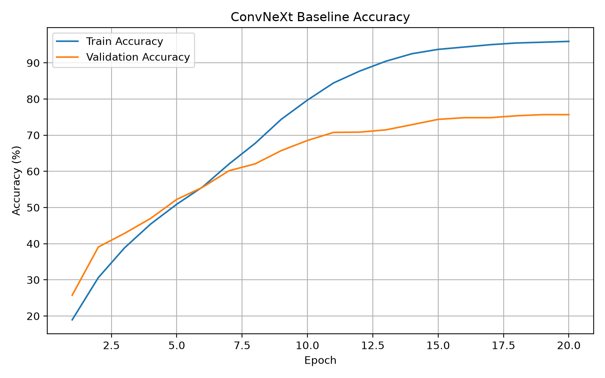
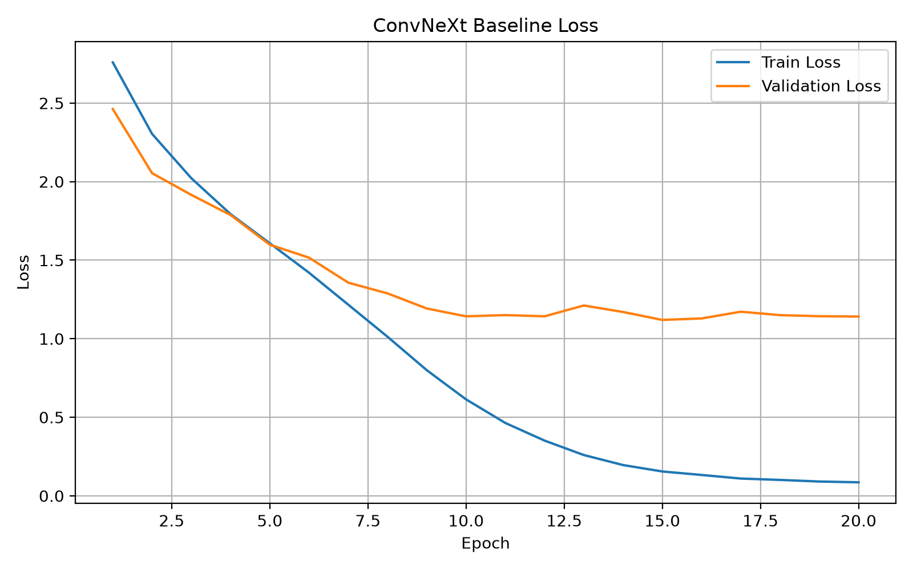
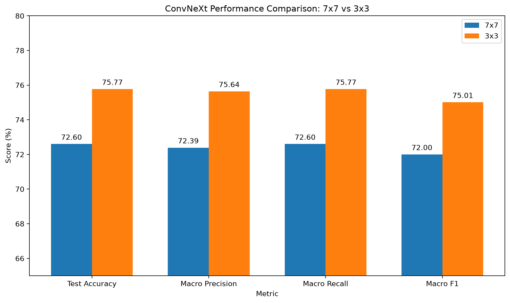
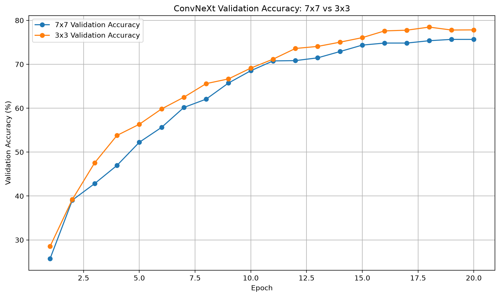
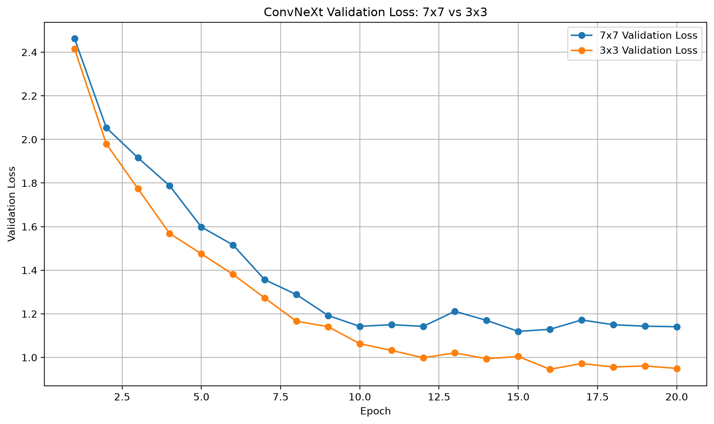
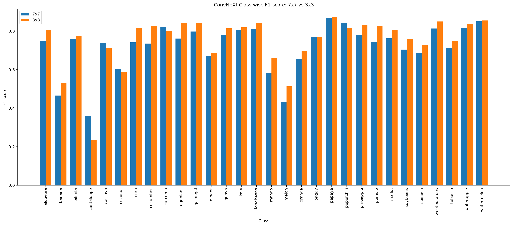
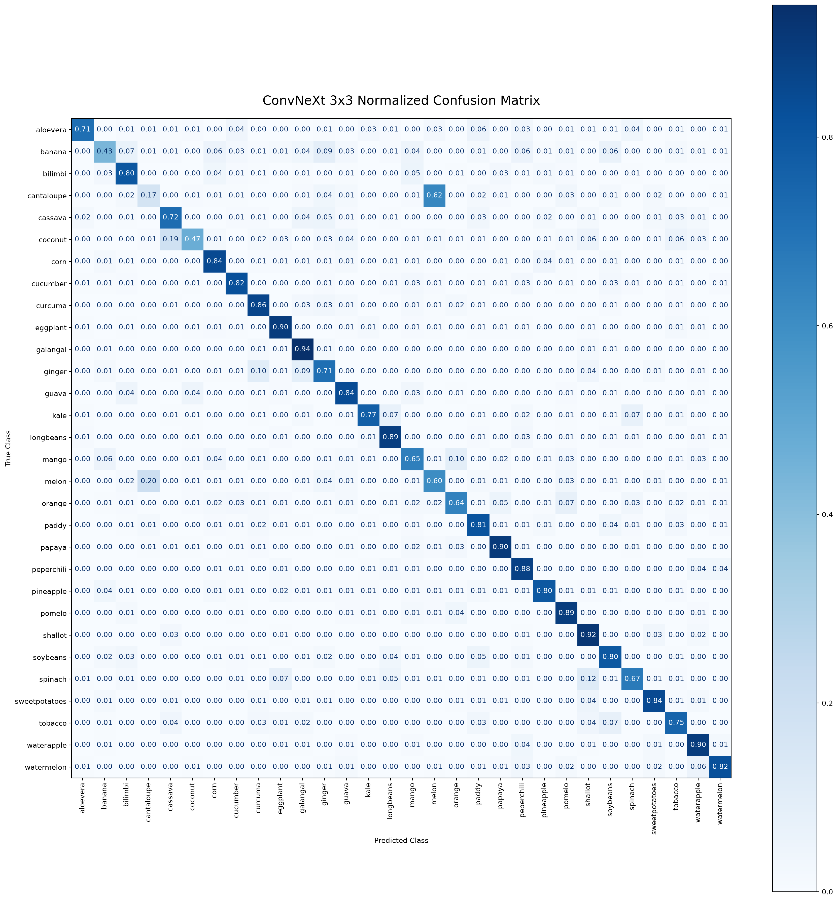

# Week 7 - ConvNeXt 구현 및 실험

## 1. 실험 목적

본 실습에서는 Liu et al., **"A ConvNet for the 2020s" (CVPR 2022)** 논문을 기반으로 ConvNeXt의 핵심 구조를 직접 구현하고, Plants Classification 데이터셋에서 image classification 실험을 수행하였다.

특히 다음 요소를 직접 구현하고 이해하는 것을 목표로 하였다.

- Depthwise Convolution
- 1×1 Pointwise Projection
- Inverted Bottleneck
- Layer Normalization
- GELU
- Patchify Stem
- Large Kernel Convolution

또한 ConvNeXt 논문에서 중요한 설계 요소인 **7×7 large-kernel depthwise convolution**의 효과를 확인하기 위해, 동일한 조건에서 kernel size만 3×3으로 변경하는 ablation study를 수행하였다.

---

## 2. Reference

**Paper**

Liu et al.,  
**"A ConvNet for the 2020s"**, CVPR 2022

- Paper: https://arxiv.org/abs/2201.03545
- Official Code: https://github.com/facebookresearch/ConvNeXt

ConvNeXt는 pure CNN architecture이지만 Vision Transformer 및 Swin Transformer에서 사용된 여러 설계 원리를 ConvNet에 적용하여 높은 성능을 달성한 모델이다.

---

## 3. Backbone / Pretraining 여부

본 실습에서는 torchvision 또는 공식 repository에서 제공하는 pretrained ConvNeXt backbone을 사용하지 않았다.

| 항목 | 설정 |
|---|---|
| Architecture | ConvNeXt-based lightweight CNN |
| Reference architecture | ConvNeXt |
| Pretrained backbone | No |
| Pretrained weights | No |
| Training method | From scratch |
| Model implementation | 직접 구현 |

즉, **ConvNeXt 논문의 구조를 참고하여 축소형 ConvNeXt 모델을 직접 구현하고 처음부터 학습하였다.**

---

## 4. Dataset

이전 Vision Transformer 실습에서 사용한 Plants Classification 데이터셋을 동일하게 사용하였다.

| Split | Number of Images |
|---|---:|
| Train | 21,000 |
| Validation | 3,000 |
| Test | 6,000 |
| Total Classes | 30 |

입력 이미지 크기는 **128×128**로 설정하였다.

### Data Augmentation

Training dataset에는 다음 augmentation을 적용하였다.

- Resize: 144×144
- Random Crop: 128×128
- Random Horizontal Flip: p=0.5
- Random Rotation: ±10°
- ImageNet normalization

Validation 및 Test dataset에서는 augmentation 없이 128×128 resize와 normalization만 적용하였다.

### Augmentation 적용 이유

Training data에 crop, flip, rotation을 적용하여 동일한 이미지의 다양한 변형을 학습하도록 하고, 모델이 training dataset 자체에 과도하게 적합되는 것을 완화하고자 하였다.

---

## 5. Model Architecture

원 논문의 ConvNeXt-T는 다음과 같은 설정을 사용한다.

- Depths: (3, 3, 9, 3)
- Dims: (96, 192, 384, 768)
- Parameters: 약 28.6M

본 실습에서는 CPU 기반 학습시간과 실습 목적을 고려하여 다음과 같이 축소하였다.

- Depths: (2, 2, 3, 2)
- Dims: (64, 128, 256, 512)
- Parameters: **6,927,454**
- Number of Classes: 30

원본 구조를 그대로 사용하지는 않았지만, ConvNeXt의 핵심적인 4-stage hierarchical 구조와 stage가 증가할수록 channel 수가 증가하는 설계는 유지하였다.

---

## 6. ConvNeXt Block

본 실습에서 구현한 ConvNeXt Block은 다음과 같다.

```text
Input
  ↓
7×7 Depthwise Convolution
  ↓
Layer Normalization
  ↓
1×1 Pointwise Projection
C → 4C
  ↓
GELU
  ↓
1×1 Pointwise Projection
4C → C
  ↓
Residual Connection
  ↓
Output
````

### 6.1 Depthwise Convolution

일반 convolution은 spatial dimension과 channel dimension을 동시에 처리하지만, depthwise convolution은 각 channel에 독립적으로 convolution을 수행한다.

```python
groups=dim
```

을 사용하여 구현하였다.

ConvNeXt에서는 spatial mixing을 depthwise convolution이 담당하고, channel mixing을 1×1 pointwise projection이 담당한다.

### 6.2 Inverted Bottleneck

기존 ResNet bottleneck은 channel을 줄였다가 다시 확장하는 구조를 사용하지만 ConvNeXt에서는 반대로 중간 dimension을 확장한다.

```text
C → 4C → C
```

본 실습에서도 expansion ratio를 4로 설정하였다.

이는 Transformer의 MLP block에서 hidden dimension을 약 4배 확장하는 구조와 유사하다.

### 6.3 Layer Normalization

기존 ConvNet에서 자주 사용되는 Batch Normalization 대신 ConvNeXt 논문의 설계를 따라 Layer Normalization을 적용하였다.

Transformer 계열 모델에서 사용되는 normalization 방식을 ConvNet에 적용한 ConvNeXt의 주요 설계 중 하나이다.

### 6.4 GELU

기존 CNN에서 주로 사용하는 ReLU 대신 GELU를 사용하였다.

ConvNeXt 논문에서는 Transformer architecture의 설계를 반영하여 activation function을 GELU로 변경하고 block 내부의 activation 수 역시 줄였다.

### 6.5 Large Kernel

ConvNeXt는 3×3 convolution 대신 **7×7 depthwise convolution**을 사용한다.

큰 kernel을 사용하여 더 넓은 receptive field를 확보하고 Transformer의 넓은 spatial interaction과 유사한 효과를 얻고자 한 설계이다.

---

## 7. Training Configuration

| Hyperparameter | Setting           |
| -------------- | ----------------- |
| Epochs         | 20                |
| Batch Size     | 32                |
| Input Size     | 128×128           |
| Optimizer      | AdamW             |
| Learning Rate  | 3e-4              |
| Weight Decay   | 0.05              |
| Scheduler      | CosineAnnealingLR |
| Loss           | CrossEntropyLoss  |
| Training       | From scratch      |
| Device         | CPU               |

---

## 8. Hyperparameter 및 Training Setting 선정 이유

### CrossEntropyLoss

본 문제는 하나의 이미지가 30개의 plant class 중 하나에 속하는 **single-label multi-class classification** 문제이다.

따라서 각 class의 logit을 기반으로 정답 class의 확률을 최대화하도록 학습하는 CrossEntropyLoss를 사용하였다.

### AdamW

ConvNeXt 논문에서도 AdamW optimizer를 사용한다.

AdamW는 weight decay를 gradient update와 분리하여 적용하며, Transformer 계열 및 ConvNeXt와 같은 modern architecture에서 널리 사용된다.

따라서 ConvNeXt의 training recipe를 최대한 반영하기 위해 AdamW를 사용하였다.

### Weight Decay = 0.05

원 논문의 ImageNet-1K 학습 설정에서도 weight decay 0.05를 사용하므로 동일하게 적용하였다.

모델 parameter가 training data에 지나치게 적합되는 것을 완화하기 위한 regularization 목적으로 사용하였다.

### Learning Rate = 3e-4

원 논문에서는 ImageNet-1K에서 batch size 4096과 learning rate 4e-3을 사용한다.

하지만 본 실습에서는 batch size 32, 약 6.93M parameter의 축소 모델, 30-class Plants 데이터셋을 사용하므로 원 논문의 learning rate를 그대로 적용하지 않았다.

작은 batch와 from-scratch 환경에서 안정적인 학습을 위해 3e-4로 축소하여 설정하였다.

본 값은 여러 learning rate를 exhaustive search하여 얻은 최적값이 아니라, **실습 환경에 맞추어 설정한 hyperparameter**이다.

### Batch Size = 32

본 실습은 로컬 CPU 환경에서 수행되었으므로 메모리 및 학습시간을 고려하여 batch size 32를 사용하였다.

### Epoch = 20

원 논문은 ImageNet에서 300 epoch 학습하지만, 본 실습은 논문의 전체 성능 재현보다 ConvNeXt architecture 이해와 비교실험을 목적으로 하며 CPU에서 학습을 수행하였다.

따라서 학습시간을 고려하여 20 epoch로 제한하였다.

### CosineAnnealingLR

학습 초반에는 비교적 큰 learning rate로 parameter를 탐색하고, 학습 후반에는 learning rate를 점차 감소시켜 안정적으로 수렴하도록 하기 위해 cosine learning-rate scheduling을 적용하였다.

---

## 9. Baseline Experiment - 7×7 Kernel

ConvNeXt 논문의 기본 설계를 따라 depthwise convolution의 kernel size를 7×7로 설정하였다.

### Result

| Metric                   |     Result |
| ------------------------ | ---------: |
| Best Epoch               |         19 |
| Best Validation Accuracy | **75.67%** |
| Test Accuracy            | **72.60%** |
| Macro Precision          | **72.39%** |
| Macro Recall             | **72.60%** |
| Macro F1-score           | **72.00%** |

### Training Analysis

Training accuracy는 epoch가 증가하면서 지속적으로 증가하여 약 95.93%까지 도달하였다.

반면 validation accuracy는 약 75% 수준에서 포화되었다.

또한 training loss는 지속적으로 감소했지만 validation loss는 학습 중반 이후 약 1.1 수준에서 정체되었다.

따라서 학습 후반부에서 training data와 validation data 사이의 generalization gap이 증가했으며, 일부 overfitting 경향이 나타난 것으로 판단하였다.





---

## 10. Ablation Study - 7×7 vs 3×3

ConvNeXt 논문에서는 large-kernel depthwise convolution을 중요한 architecture design으로 제안한다.

본 실습에서는 large kernel의 효과가 Plants Classification 및 축소 ConvNeXt 환경에서도 동일하게 나타나는지 확인하기 위해 kernel size만 변경하였다.

### Controlled Variables

다음 조건은 모두 동일하게 유지하였다.

* Dataset
* Train / Validation / Test split
* Data augmentation
* Model depths
* Model dims
* Batch size
* Learning rate
* Optimizer
* Weight decay
* Epoch
* Scheduler

변경한 것은 다음 하나뿐이다.

```text
Depthwise Convolution Kernel

7×7 → 3×3
```

---

## 11. Quantitative Results

| Model        | Best Val Acc |    Test Acc | Macro Precision | Macro Recall |    Macro F1 |
| ------------ | -----------: | ----------: | --------------: | -----------: | ----------: |
| ConvNeXt 7×7 |       75.67% |      72.60% |          72.39% |       72.60% |      72.00% |
| ConvNeXt 3×3 |   **78.47%** |  **75.77%** |      **75.64%** |   **75.77%** |  **75.01%** |
| Difference   |  **+2.80%p** | **+3.17%p** |     **+3.25%p** |  **+3.17%p** | **+3.01%p** |

3×3 모델은 Accuracy뿐 아니라 Precision, Recall, F1-score에서도 약 3%p 수준의 개선을 보였다.



---

## 12. Training Curve Comparison

Validation accuracy를 비교하면 3×3 모델이 대부분의 epoch에서 7×7보다 높은 성능을 보였다.

또한 validation loss 역시 3×3 모델이 전반적으로 더 낮은 값을 유지하였다.

따라서 본 실험 조건에서는 3×3 depthwise convolution이 7×7보다 validation set에 대해 더 안정적인 generalization 성능을 보였다.





---

## 13. Class-wise F1 Analysis

전체 평균 성능만으로는 각 class의 변화 양상을 확인하기 어렵기 때문에 class-wise F1-score를 추가로 비교하였다.

### Top 5 Improved Classes

| Class    | 7×7 F1 | 3×3 F1 |  Difference |
| -------- | -----: | -----: | ----------: |
| cucumber | 0.7353 | 0.8250 | **+0.0897** |
| pomelo   | 0.7419 | 0.8279 | **+0.0861** |
| melon    | 0.4305 | 0.5127 | **+0.0822** |
| mango    | 0.5820 | 0.6616 | **+0.0796** |
| eggplant | 0.7615 | 0.8404 | **+0.0789** |

### Top 5 Decreased Classes

| Class      | 7×7 F1 | 3×3 F1 |  Difference |
| ---------- | -----: | -----: | ----------: |
| cantaloupe | 0.3584 | 0.2340 | **-0.1243** |
| peperchili | 0.8431 | 0.8159 |     -0.0273 |
| cassava    | 0.7379 | 0.7111 |     -0.0268 |
| curcuma    | 0.8201 | 0.8019 |     -0.0183 |
| coconut    | 0.6025 | 0.5893 |     -0.0131 |



3×3 모델이 전체적으로 더 높은 성능을 기록했지만 모든 class가 일관되게 개선된 것은 아니었다.

특히 cantaloupe class는 다른 class와 달리 성능이 크게 감소하였다.

---

## 14. Confusion Matrix Analysis

Class-wise 결과를 보다 세부적으로 분석하기 위해 normalized confusion matrix를 확인하였다.

특히 cantaloupe와 melon 사이에서 큰 차이가 나타났다.

7×7 모델에서는 실제 cantaloupe의 약 31%를 올바르게 분류하고 약 39%를 melon으로 오분류하였다.

3×3 모델에서는 cantaloupe recall이 약 17%로 감소하고 약 62%가 melon으로 오분류되었다.

반대로 melon class의 correct classification 비율은 약 40%에서 약 60%로 증가하였다.

따라서 3×3 모델이 전체 성능은 개선했지만, 일부 유사한 class 사이에서는 한 class의 성능 개선과 다른 class의 성능 저하가 함께 나타나는 trade-off가 존재하였다.

### 7×7


### 3×3



---

## 15. Comparison with Original Paper

원 논문의 ConvNeXt-T는 ImageNet-1K에서 약 **82.1% Top-1 Accuracy**를 기록한다.

하지만 본 실험 결과와 원 논문의 성능을 직접적으로 비교하는 것은 적절하지 않다.

### Original ConvNeXt-T

* Dataset: ImageNet-1K
* Classes: 1000
* Input: 224×224
* Parameters: 약 28.6M
* Epochs: 300
* Batch Size: 4096
* Advanced augmentation 및 regularization 사용

### This Experiment

* Dataset: Plants Classification
* Classes: 30
* Input: 128×128
* Parameters: 약 6.93M
* Epochs: 20
* Batch Size: 32
* CPU training
* From scratch

따라서 절대 Accuracy 차이보다 **architecture 변화에 따른 상대적인 성능 변화**를 중심으로 분석하였다.

원 논문에서는 large kernel의 효과가 나타나 7×7 kernel이 최종 ConvNeXt 구조에 채택되었다.

반면 본 실험에서는 3×3 모델이 7×7 모델보다 Test Accuracy 기준 **3.17%p 높은 성능**을 기록하였다.

이는 다음과 같은 실험 조건 차이의 영향을 받았을 가능성이 있다.

* 입력 이미지 해상도 차이
* Dataset 규모 차이
* Model capacity 차이
* Training epoch 차이
* Data augmentation 및 regularization 차이
* From-scratch 학습 환경

따라서 본 실험에서는 **large kernel의 효과가 데이터 규모와 입력 해상도, 모델 크기 및 학습 조건에 따라 달라질 가능성**을 관찰하였다.

---

## 16. Limitations

본 실험에는 다음 한계가 있다.

1. 단일 random seed를 사용하였다.
2. Learning rate와 batch size를 systematic하게 sweep하지 않았다.
3. 원 논문보다 작은 dataset과 모델을 사용하였다.
4. CPU 환경으로 인해 training epoch를 20으로 제한하였다.
5. Mixup, CutMix, RandAugment, Random Erasing, stochastic depth, EMA 등 원 논문의 전체 training recipe를 재현하지 않았다.
6. 7×7과 3×3 비교만 수행했으며 5×5, 9×9 등의 추가 kernel size는 비교하지 않았다.

따라서 이번 결과만으로 3×3 kernel이 일반적으로 ConvNeXt에서 더 우수하다고 결론 내릴 수는 없다.

---

## 17. Conclusion

본 실습에서는 ConvNeXt 논문의 핵심 구조인 depthwise convolution, pointwise projection, inverted bottleneck, Layer Normalization, GELU 및 large-kernel convolution을 직접 구현하였다.

Pretrained backbone을 사용하지 않고 Plants Classification 데이터셋에서 from scratch로 학습하였다.

7×7 ConvNeXt baseline은 Test Accuracy **72.60%**, Macro F1 **72.00%**를 기록하였다.

Kernel size를 3×3으로 변경한 ablation에서는 Test Accuracy **75.77%**, Macro F1 **75.01%**로 성능이 향상되었다.

Accuracy뿐 아니라 Precision, Recall, F1-score, class-wise F1 및 Confusion Matrix까지 분석함으로써 단순 전체 성능 외에 class별 성능 차이까지 확인하였다.

원 논문에서는 7×7 large kernel이 효과적이었지만, 본 축소 실험에서는 3×3이 더 높은 성능을 보여 원 논문의 설계 효과가 실험 환경에 따라 다르게 나타날 수 있음을 관찰하였다.